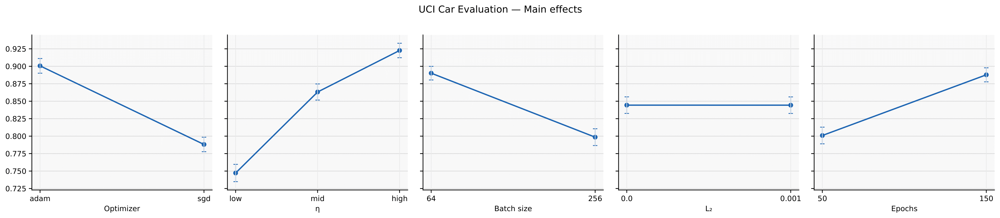
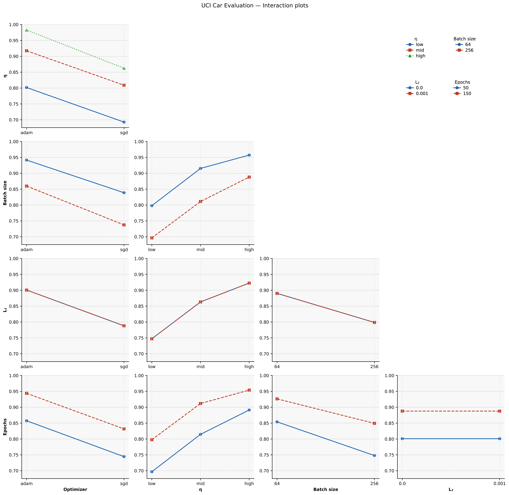

<p align="center">
  <a href="https://arxiv.org/abs/XXXX.XXXXX">
    
  </a>
  <a href="https://github.com/AndrewKim1997/FACTORS/actions/workflows/ci.yml">
    
  </a>
  <a href="https://github.com/AndrewKim1997/FACTORS/actions/workflows/docker-ci.yml">
    
  </a>
  <a href="docker/README.md">
    
  </a>
  
  <a href="LICENSE">
    
  </a>
</p>

<h1 align="center">FACTORS: DOE–SHAP Two-Factor Optimization with Risk Scoring</h1>

> **FACTORS** is an experimental design and decision-making framework grounded in **factorial design**. It centers on **two-factor (A×B)** analyses while **scaling to three or more factors**. From observed data, it estimates main and interaction effects using either **cell means (CM path)** or **model-based SHAP contributions (SF path)**. On top of these estimates, it builds a **risk-adjusted score** that accounts for both **uncertainty** and **cost**, then selects combinations under **budget constraints**.
>
> The framework supports both **full** and **fractional** factorial designs, including **unbalanced** or **missing** cells. For three or more factors it uses **pairwise (two-factor) approximations** to reduce dimensionality and improve interpretability, and when needed, inspects **three-way interaction signals** through ablations and diagnostic indicators. Throughout, it quantifies complementarity via the **Pairwise Complementarity Index (PCI)** and evaluates reliability with **bootstrap confidence intervals** and **sample-complexity analysis**.

* **Paper (preprint)**: <em>FACTORS: Factorial Approximation for Complementary Optimization with Risk-aware Scoring</em> — arXiv: [XXXX.XXXXX](https://arxiv.org/abs/XXXX.XXXXX)
* **Core idea**: estimate cell means either from observed outcomes (**CM path**) or via **SHAP-fit** (least-squares reconstruction from SHAP attributions), form a **factorial-design approximation** (main effects + interactions), then optimize a risk-aware objective. Report the **Pairwise Complementarity Index (PCI)** and bootstrap-based uncertainty for interpretability.

---

## ✨ TL;DR

* **Two routes** for cell means:
  **CM** (empirical cell means) and **SF** (SHAP-fit via linear LS on SHAP values).
* **Risk-adjusted score**: tune **κ** (uncertainty penalty) and **ρ** (cost weight) for robust choices.
* **Budgeted selection**: greedy/beam/exhaustive under a user-provided budget.
* **Uncertainty**: nonparametric **bootstrap** CIs for cell means and derived quantities.
* **Diagnostics**: **PCI** to quantify complementarity and interaction strength.

---

## 📊 Results at a glance

<p align="center">
  <a href="results/figures/car_main_effects_row.pdf">
    
  </a><br>
  <sub>Main effects (click to open PDF)</sub>
</p>

<p align="center">
  <a href="results/figures/car_interactions_staircase_p1.pdf">
    
  </a><br>
  <sub>Interaction (staircase) — Pairwise complementarity (click to open PDF)</sub>
</p>

---

## 📚 Table of Contents

* [Install](#-install)
* [Quick start](#-quick-start)
* [Ablations](#-ablations)
* [Reproducibility](#-reproducibility)
* [Datasets](#-datasets)
* [Docker](#-docker)
* [Repository layout](#-repository-layout)
* [Cite](#-cite)
* [Contributing](#-contributing)
* [License](#-license)

---

## 🚀 Install

### Option A — Conda

```bash
conda env create -f envs/conda-cpu.yml
conda activate factors
pip install -e ".[dev]"
```

### Option B — venv + pip

```bash
python -m venv .venv && source .venv/bin/activate
python -m pip install -U pip
pip install -r envs/pip-cpu.txt
pip install -e ".[dev]"
```

> GPU users: use `envs/conda-gpu.yml` (or `pip-gpu.txt`) and set `device="cuda"` in configs.

---

## ⚡ Quick start

1. **Fetch public datasets**

```bash
bash scripts/download_data.sh concrete car fmnist
```

2. **Run a single experiment** (Concrete · CPU)

```bash
python scripts/run_experiment.py \
  --config configs/datasets/concrete.yaml \
  --seed 0 \
  --out experiments/sanity/concrete/run1/seed_0
```

Outputs (per run):

```
cell_means.csv
bootstrap_replicates.parquet  # or .pkl
bootstrap_ci.csv
score.csv
metrics.json
run_metadata.json
```

3. **Aggregate to tables/figures**

```bash
python scripts/make_tables_figs.py \
  --inputs "experiments/**/metrics.json" \
  --out results/figures
```

4. **Reproduce canonical runs** (tables/figures for the paper)

```bash
bash scripts/reproduce_all.sh
# uses configs/runs/main.yaml (preserves order)
```

---

## 🧪 Ablations

We provide ablation configs under `configs/ablations/`:

* **Shrinkage**: `shrinkage_low|mid|high.yaml`
* **Risk sweep**: `risk_lambda_sweep.yaml` (grid over κ, ρ)
* **Designs**: `design_balanced.yaml`, `design_skewed.yaml`

Example:

```bash
python scripts/run_experiment.py \
  --config configs/ablations/risk_lambda_sweep.yaml \
  --seed 0 \
  --out experiments/ablation/risk_lambda/sweep/seed_0
```

---

## 🔁 Reproducibility

* **Seeds**: set via `--seed` (also see `configs/global.yaml: reproducibility.seed_list`).
* **Provenance**: every run writes `run_metadata.json` (commit, timestamp, Python, config snapshot).
* **Environment**: Python **3.10–3.12** supported; export with:

  ```bash
  python -m pip freeze > results/metrics/requirements-$(date -u +%Y%m%dT%H%M%SZ).txt
  git rev-parse HEAD > results/metrics/git-commit.txt
  ```
* **Determinism**: best-effort flags in `src/factors/utils.py` (`enable_deterministic_torch`).

See `REPRODUCIBILITY.md` for one-click/one-command instructions.

---

## 🗂️ Datasets

* **Concrete** (UCI): regression — `configs/datasets/concrete.yaml`
* **Car** (UCI): classification — `configs/datasets/car.yaml`
* **Fashion-MNIST**: image classification (via `torchvision`) — `configs/datasets/fmnist.yaml`

Guidelines:

* Do **not** commit large data. See `data/README.md`.
* Use `scripts/download_data.sh` to fetch public data.
* Verify checksums in `data/hashes.json` when applicable.

---

## 🐳 Docker

**Images**

* **CPU** — slim scientific stack
* **GPU** — CUDA base + torch/torchvision

**Build locally**

```bash
docker build -f docker/Dockerfile.cpu -t factors:cpu .
docker build -f docker/Dockerfile.gpu -t factors:gpu .
```

**Run (CPU)**

```bash
docker run --rm -it -v "$PWD:/app" factors:cpu \
  bash -lc 'python scripts/run_experiment.py --config configs/datasets/concrete.yaml --seed 0 --out experiments/sanity/concrete/seed_0'
```

**Run (GPU)**

```bash
docker run --gpus all --rm -it -v "$PWD:/app" factors:gpu \
  bash -lc 'python scripts/run_experiment.py --config configs/datasets/fmnist.yaml --seed 0 --out experiments/sanity/fmnist/seed_0 --device cuda'
```

CI builds/pushes images via **`.github/workflows/docker-ci.yml`** (GHCR).
Owner/repo are lower-cased in tags to satisfy Docker rules.

---

## 🧭 Repository layout

```
FACTORS/
├── src/factors/           # effects.py, shap_fit.py, score.py, optimizer.py, pci.py, bootstrap.py, io.py, utils.py
├── configs/               # global.yaml, datasets/, ablations/, runs/
├── scripts/               # download_data.sh, run_experiment.py, reproduce_all.sh, make_tables_figs.py, check_env.py
├── docker/                # Dockerfile.cpu, Dockerfile.gpu, entrypoint.sh, compose.dev.{cpu,gpu}.yml, README.md
├── envs/                  # conda-*.yml, pip-*.txt
├── experiments/           # run outputs (lightweight artifacts only)
├── results/               # logs, metrics, figures, tables
├── tests/                 # unit & integration (sanity)
├── notebooks/             # optional analysis; keep outputs small
└── REPRODUCIBILITY.md     # one-click/one-command reproduction
```

---

## 📝 Cite

If you use this repository, please cite the preprint:

```bibtex
@misc{kim2025factors,
  title        = {FACTORS: Factorial Approximation for Complementary Two-factor Optimization with Risk Scoring},
  author       = {Kim, Dongseok and Jeong, Wonjun and Oh, Gisung},
  year         = {2025},
  eprint       = {XXXX.XXXXX},
  archivePrefix = {arXiv},
  primaryClass = {cs.LG}
}
```

---

## 🤝 Contributing

Contributions are welcome!
Please check **CONTRIBUTING.md** and **CODE\_OF\_CONDUCT.md**. Before submitting a PR:

* run `pytest` (unit + sanity integration),
* ensure **ruff/black** pass,
* keep artifacts small and exclude large data/checkpoints from commits.

---

## 📄 License

Code is released under the **MIT License** (see `LICENSE`).
Datasets remain subject to their original licenses.
